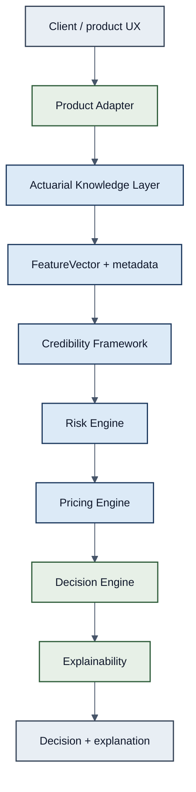

# Figure 1 — Overall AIC Architecture

**Caption.** End-to-end AIC v1.0 pipeline. Actuarial core layers (blue) are product-independent; green layers apply product packaging and communication. Products never call actuarial engines directly.
