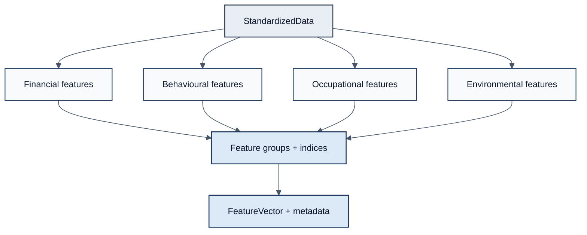

# Figure 2 — Actuarial Knowledge Layer

**Caption.** Observations become actuarial concepts before credibility or risk estimation. Groups are retained for dashboards; a flattened vector feeds downstream engines. Occupation hazards are table-driven assumptions, not hard-coded business rules.
