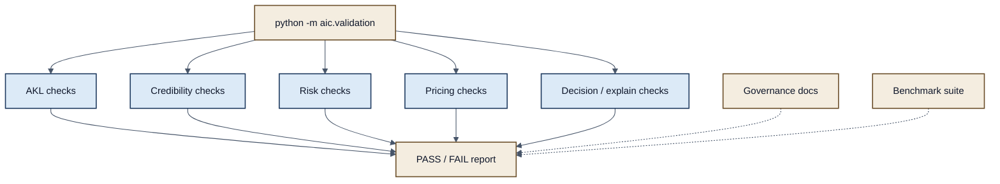

# Figure 5 — Validation Workflow

**Caption.** Research validation verifies layer identities and decision rules. Governance documentation and the prototype benchmark supply complementary evidence; neither substitutes for real-world outcome studies.
